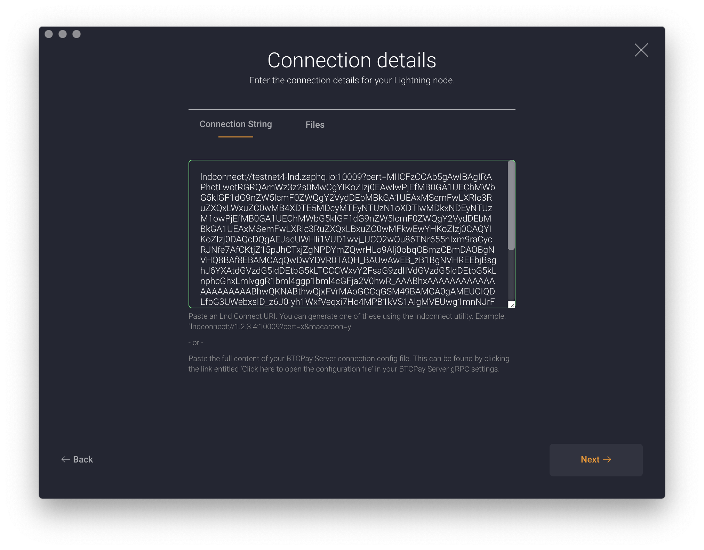
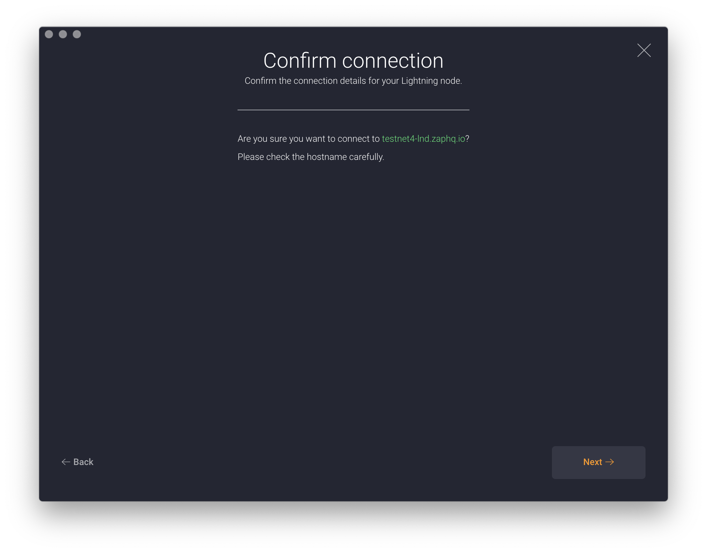
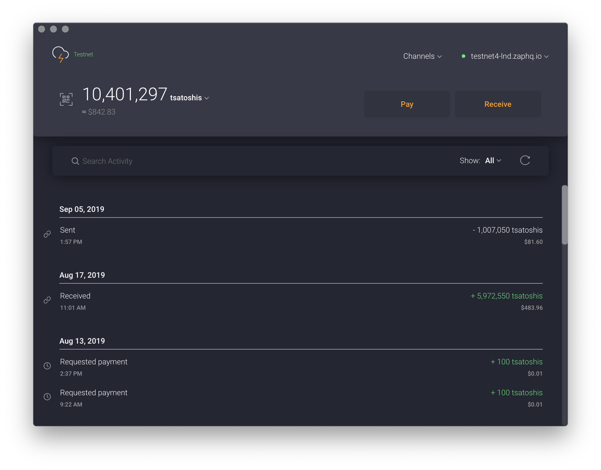

# LND Remote Control

This tutorial assumes that you have already [downloaded and installed Zap](http://zaphq.io/download) and have an existing LND node that you want to connect to. If not, please head over
to our [guide to configuring your LND node](/docs-desktop-lnd-configure).

## Create a new wallet in Zap

Open up Zap and select the `Connect` option from the wallet creation screen.

## Paste LND Connect string

An [LND Connect string](https://github.com/LN-Zap/lndconnect) encodes everything that you need to connect to a remote LND instance, including:

- LND node address and port
- TLS certificate
- Admin macaroon

Please see our [guide to configuring your LND node](/docs-desktop-lnd-configure) for details on how to prepare your LND node and generate an LND Connect string for your LND node.

## Verify hostname

Before establising the connection, verify that the hostname or IP address shown matches that of the node that you want to connect to.

## Control your node!

Once connected you can use the full power of Zap to control and manage your LND node!

